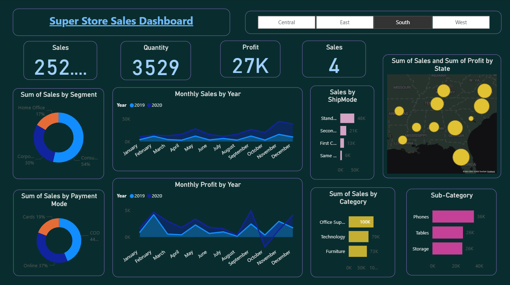
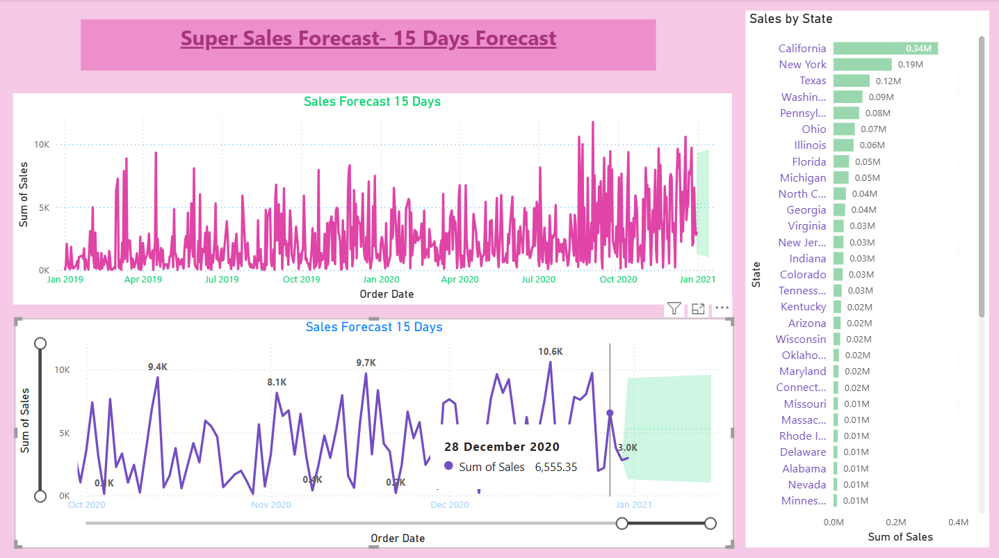
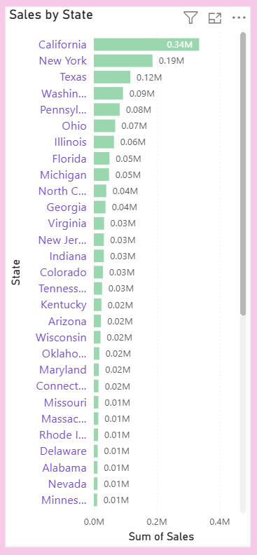
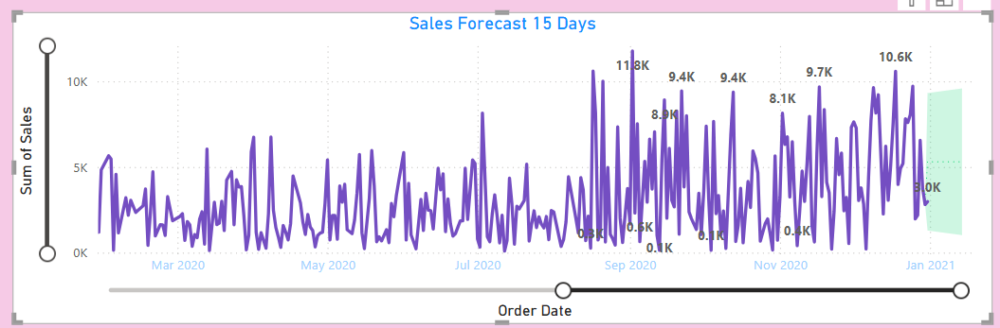

# Super_sales_Data_analysis_dashboard
The Super Store Sales Dashboard shows that Consumers (54%), Office Supplies, and COD payments drive most revenue. Sales peak in Nov–Dec, especially in California and New York. Standard shipping is most used.

### 🟦 Dashboard 1 – *Super Store Sales Dashboard*

* **Top KPIs**

  * Sales: 252K
  * Quantity: 3529 units
  * Profit: 27K
  * Sales Orders: 4

* **Sales by Segment**

  * Consumer (54%) is the largest customer group
  * Corporate (30%)
  * Home Office (17%)

* **Monthly Sales & Profit (2019 vs 2020)**

  * Both sales and profit rise at year-end (Nov–Dec).
  * 2020 overall performs better than 2019.

* **Sales by Payment Mode**

  * COD (44%)
  * Online (37%)
  * Cards (19%)

* **Sales by Ship Mode**

  * Standard Class dominates (\~48K)
  * Second Class, First Class, Same Day much smaller.

* **Sales by State (map)**

  * Southern states like Florida, Georgia, and Texas have strong sales.

* **Sales by Category**

  * Office Supplies (\~100K) lead
  * Technology (\~79K)
  * Furniture (\~73K)

* **Top Sub-Categories**

  * Phones (36K)
  * Tables (26K)
  * Storage (26K)

✅ **Insight**: Consumers, COD payments, and office supplies drive most revenue. Year-end boosts sales.

---

### 🟪 Dashboard 2 – *Super Sales Forecast (15 Days)*

* **Sales Forecast Line (2019–2020)**

  * Sales are very scattered (high fluctuations).
  * Peaks around holidays (Nov–Dec).

* **15-Day Forecast Zoom (Dec 2020)**

  * On **28 Dec 2020**, predicted sales = **6.5K**.
  * Model predicts spikes above 10K on some days.

* **Sales by State (Bar Chart)**

  * California leads (0.34M)
  * New York (0.19M), Texas (0.12M), Washington (0.09M) follow.
  * Most other states < 0.05M.

✅ **Insight**:

* California & New York dominate sales.
* Forecast suggests strong daily fluctuations, with December being the most profitable.
